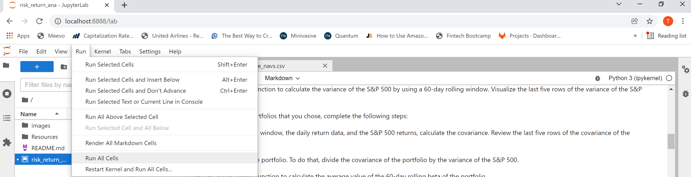
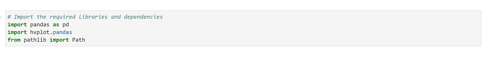

# San Francisco Housing Analysis
The purpose of the San Francisco housing assignment is to evaluate a proposed buy and rent one-click service in the San Francisco area. This will be completed using data visualization skills, aggregation, interactive visualizations and geospatial analysis. This should allow you to identify potential properties that fit this investment model. If the service proves viable, then it can be expanded to similar areas.


---

## Technologies

The financial planner leverages Python 3.8+ and utilizes the following project libraries and dependencies:
* [JupyterLab](https://jupyterlab.readthedocs.io/en/stable/) - a single integrated development environment (IDE) that allows you to write and run Python programs and review the results in one place
* [Pandas](https://pandas.pydata.org/) - a software library designed for open source data analysis and manipulation
- hvplot
- GeoViews


---

## Installation Guide


Download Anaconda for your operating system and the latest Python version, run the installer, and follow the steps. Restart the terminal after completing the installation. Detailed instructions on how to install Anaconda can be found in the [Anaconda documentation](https://docs.anaconda.com/anaconda/install/).

Install the PyViz Ecosystem

PyViz is a Python visualization package that provides a single platform for accessing hvplot and GeoViews.

To install this library, run the following command in your terminal:

```python
conda install -c pyviz hvplot geoviews
```

---

## Usage
The San Francisco housing analysis is hosted on the following GitHub repository at: https://github.com/nguyenthuyt/san_francisco_housing   

### **Run instructions:**
To run this analysis, simply clone the repository or download the files and launch the **san_francisco_housing.ipynb** in JupyterLab

To launch JupyterLab, follow these steps:

In your open terminal window (Terminal for macOS or Git Bash for Windows), navigate (`CD`) to the repo directory and then confirm that the term (dev) appears at the beginning of your command prompt. Type:
```python
conda activate dev
```

Then type: 
```python
jupyter lab --ContentsManager.allow_hidden=True
```

An instance of the JupyterLab user interface automatically opens in your browser. On the left-hand side menu, double-click the **san_francisco_housing.ipynb** file to open the notebook.

Navigate to **'Run'** on the menu bar and select **'Run All Cells'** from the drop-down menu. Otherwise, run each individual cell with ctrl+enter.




If running each cell individually, first run the cell to import the required libraries and dependencies: 




### **Step 1: Import the data**
Before using, it is required to load market data. In this analysis market data is loaded by using the Path function from pathlib and located in the Resources folder as 'sfo_neighborhoods_census_data.csv'. To import the data, type:

```python
sfo_data_df = pd.read_csv(Path("./Resources/sfo_neighborhoods_census_data.csv"))
```

To confirm the data was imported properly, use the head and/or tail function to review the data:

`display(df.head())`

`display(df.tail())`

----

### **Step 2: Calculate and plot the housing units per year**

In this section, you will analyze the trends in housing units, average sale price per square foot and gross rents. To do this, group the dataframe by 'year' and aggregate by the mean, then using hvplot and geoviews complete the following:

(1) Calculate and plot housing units per year


(2) Calculate and plot sale price per square foot and gross rent in San Francisco


(3) Compare average sale price per square foot and gross rent by neighborhood using the `groupby` function


(4) Build an interactive neighborhood map. For this step, use the following parameters:
```python
all_neighborhoods_df.hvplot.points(
    "Lon",
    "Lat",
    geo=True,
    size="sale_price_sqr_foot",
    color= "gross_rent",
    frame_width=700,
    frame_height=500,
    tiles="OSM",
    hover_cols=["Neighborhood","sale_price_sqr_foot","gross_rent"],
    title="Average Gross Rent and Sale Price Per Square Foot In San Francisco By Neighborhood"
)
```


### **Step 3: Buy and Rent One-click Analysis**

The company's one-click buy and rent proposal appears to be a very viable investment strategy as there are neighborhoods with low cost to purchase that would generate a healthy return such as Silver Terrace with an average cost of $170.29 per square foot and average rental rate of $3,528.


### **Quit instructions:**
After saving the file, from the menu bar, navigate to **'File'**, select **'Shutdown'** from the drop-down menu and confirm Shut Down.


In your open terminal window, deactivate the dev environment by typing:
```python
conda deactivate
```

---

## Contributors

The whale fund analysis was created as part of the Rice Fintech Bootcamp 2022 Program by:

Thuy Nguyen

Email: nguyen_thuyt@yahoo.com

LinkedIn: nguyenthuyt


---

## License

MIT


